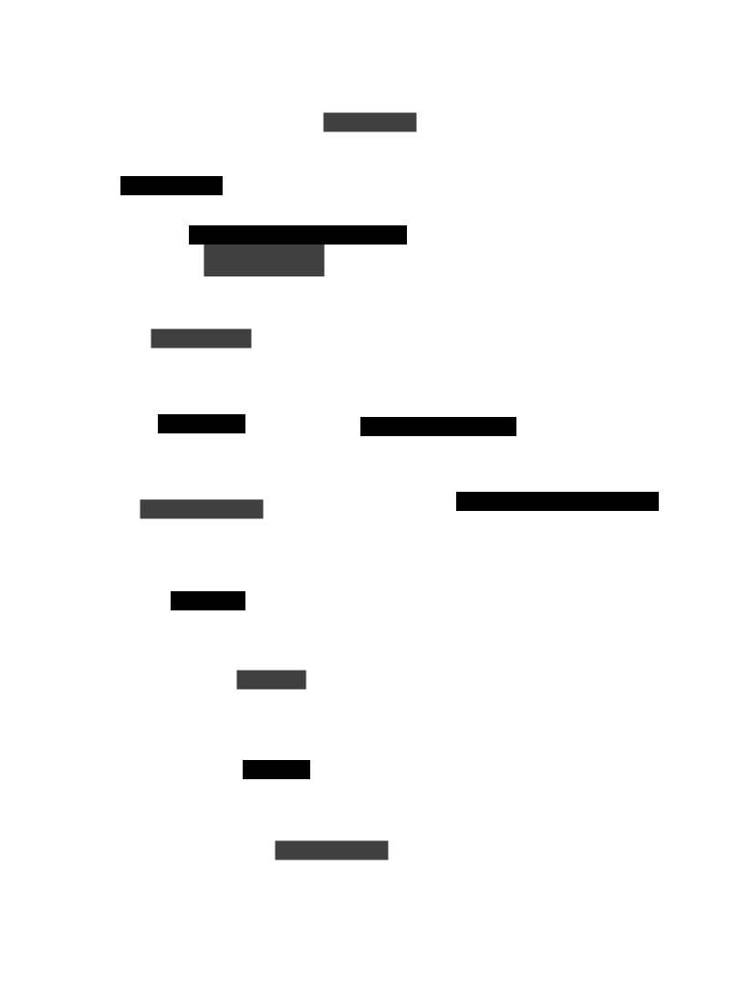

# Playwright CDP Experiment

Test exercise to see how to set up a client to control playwright via chrome CDP (chrome devtools protocol) and a web server to accept commands from.

## Situation

In restrictive environments it may not be possible to run your own code,
in situations where you have access to a browser you can control a remote playwright instance (agent) via an API (server).

## Why Not Rod or Puppeteer

Rod is a good way to avoid needing complex architecture
(sockets and communicating between node <-> go).
I chose not to use Rod because there was better documentation for
connecting over a remote port with playwright.

Puppeteer is a similar browser testing and automation tool released before playwright.
I chose not use Puppeteer because playwright appears to be
a newer iteration and may be more future-proof.
